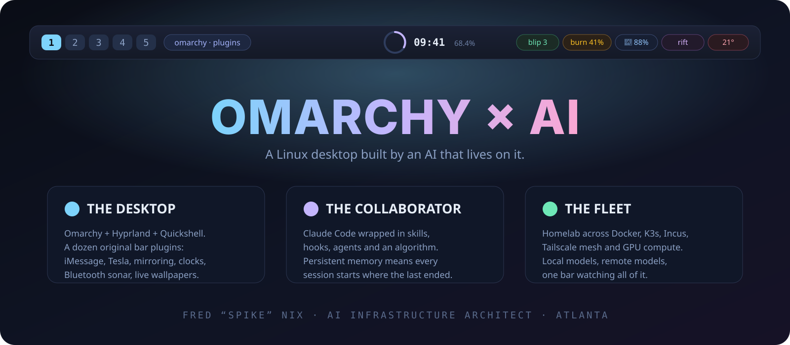
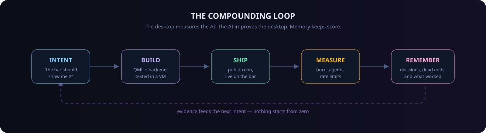
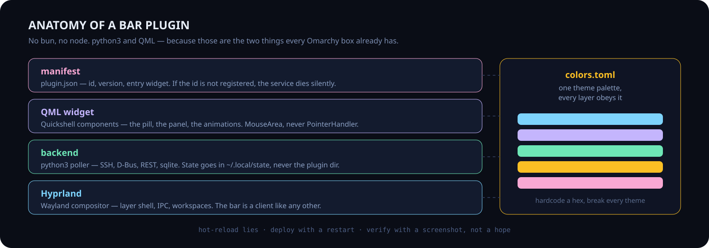
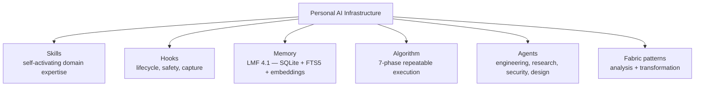
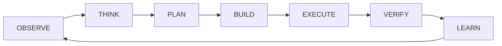
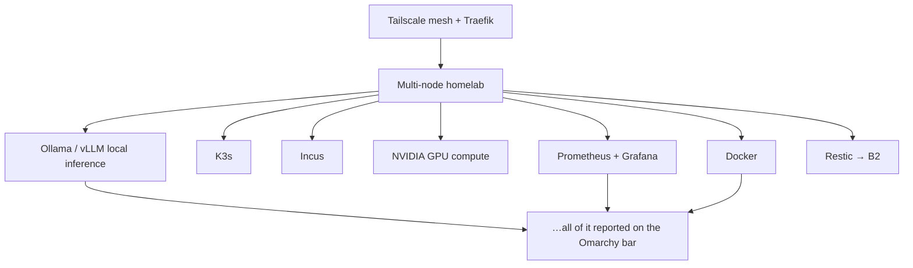
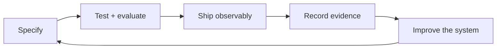

<div align="center">



# Hey, I'm Fred

### AI Infrastructure Architect. I build for Omarchy, with an AI that lives on it.

<a href="https://github.com/nixfred?tab=repositories"></a>
<a href="https://omarchy.org"></a>
<a href="https://github.com/nixfred/blip"></a>
<a href="https://github.com/nixfred/lmf4.1"></a>
<a href="https://www.linkedin.com/in/frednix/"></a>

</div>

---

Two obsessions, and they turned out to be the same one.

**[Omarchy](https://github.com/basecamp/omarchy)** — DHH's opinionated Arch + Hyprland desktop — is what I run every day. I build plugins, forks and patches on top of it.

**PAI** is the Personal AI Infrastructure I built around Claude Code: skills, hooks, memory, and a repeatable algorithm, so an AI collaborator holds context across months instead of minutes.

They meet on one screen. The AI writes the plugins. The plugins report on the AI. Memory keeps the score so nothing gets built twice.

That's my actual top bar:




---

## 🖥️ Part One — The Bar

Omarchy ships a beautiful bar. I kept adding things to it until the bar became my operating surface: messages, cars, backups, Bluetooth, media, agents, weather, notifications. Every one of them is a real repo, MIT-ish, installable, theme-driven.

### Built from scratch

| Plugin | What it does |
|---|---|
| **[blip](https://github.com/nixfred/blip)** ⭐ | iMessage in the Omarchy bar. Read, send, groups, blue dots — your Mac is the gateway, Linux is the client. Attachments, read receipts, the whole thing. |
| **[rift](https://github.com/nixfred/rift)** | Remembers which apps belong on a workspace and brings them back in one click. No geometry games — Hyprland tiles, Rift remembers. |
| **[infomarchy](https://github.com/nixfred/infomarchy)** | Your wallpaper becomes a live, clickable information desk: every running AI agent, a 7-day heatmap, rate limits, recent prompts, machine stats. |
| **[omarchy-chronos](https://github.com/nixfred/omarchy-chronos)** | A bar clock whose calendar has a pulse — day-progress ring, drawn moon phase, shimmering year and life rails, staggered month grid. |
| **[omarchy-halo-bluetooth](https://github.com/nixfred/omarchy-halo-bluetooth)** | A Bluetooth panel with a live sonar hero, per-device battery halos, and device-type glyphs. |
| **[omarchy-mirror](https://github.com/nixfred/omarchy-mirror)** | Mirror your screen to a Google TV / Chromecast over the LAN — gpu-screen-recorder → live HLS → go-chromecast. |
| **[workspace-names](https://github.com/nixfred/workspace-names)** | Give numbered Hyprland workspaces a title. Hover to see it, click to rename inline, a pill slides in on every switch. Numbers stay numbers. |
| **[plonk](https://github.com/nixfred/plonk)** | Packs occupied numeric workspaces into 1…N as gaps appear — order, tiling, monitor placement and focus all preserved. |
| **[swish](https://github.com/nixfred/swish)** | macOS Cmd+Tab for Hyprland: hold SUPER, tab through glass workspace cards with live preview, release to switch. |
| **[omarchy-local-intelligence](https://github.com/nixfred/omarchy-local-intelligence)** | Monitor Ollama activity and drive local models straight from the bar. |
| **[omarchy-internet-latency](https://github.com/nixfred/omarchy-internet-latency)** | A live, color-coded latency meter. Green means the problem isn't the network. |
| **[remarchy](https://github.com/nixfred/remarchy)** | Remake your Omarchy machine from a file — a declarative machine manifest with `save` / `diff` / `apply`. |
| **[omarchy-2-haxorz-theme](https://github.com/nixfred/omarchy-2-haxorz-theme)** | A midnight-blue Quattro theme with muted steel accents and warm terminal colors. |
| **[omarchy.nixfred.com](https://github.com/nixfred/omarchy.nixfred.com)** | A personal site that cosplays an Omarchy desktop — tiled windows, real theme palettes, and a resident AI. |

### Forked, patched, and fed back upstream

Other people's plugins, credited to their authors. I keep forks so I can patch them for my machine and send the fixes back upstream:

| Fork | Why |
|---|---|
| **[omarchy](https://github.com/nixfred/omarchy)** | My fork of [basecamp/omarchy](https://github.com/basecamp/omarchy) — where local patches get written before they become upstream PRs. |
| **[omarchy-tesla](https://github.com/nixfred/omarchy-tesla)** | Your Tesla in the bar: where it is, how full it is, how far that gets you — without keeping the car awake. |
| **[omarchy-weather](https://github.com/nixfred/omarchy-weather)** | Hourly, five-day, live radar and peek search. |
| **[omarchy-notification-center](https://github.com/nixfred/omarchy-notification-center)** | Every notification you were sent, kept and readable again. |
| **[omarchy-server-status](https://github.com/nixfred/omarchy-server-status)** | Agentless server and Docker monitoring — one read-only SSH round trip, nothing installed on your servers. |
| **[omarchy-docker](https://github.com/nixfred/omarchy-docker)** | Containers and compose stacks on the bar. |
| **[omarchy-theme-manager](https://github.com/nixfred/omarchy-theme-manager)** | Browse, install and remove themes from the native full-screen switcher. |
| **[omarchy-calendar-agenda](https://github.com/nixfred/omarchy-calendar-agenda)** | A minimal desktop agenda for private HTTPS iCalendar feeds. |
| **[omarchy-rclone](https://github.com/nixfred/omarchy-rclone)** | Cloud mounts, visible and mountable from the bar. |
| **[omarchy-boomux](https://github.com/nixfred/omarchy-boomux)** | Monitor coding agents and manage Boomux workspaces. |
| **[omaplug](https://github.com/nixfred/omaplug)** | Standalone plugin manager: enable, disable, update, install, remove. |
| **[atmos](https://github.com/nixfred/atmos)** | Standalone Quickshell preferences for Omarchy. |
| **[flea](https://github.com/nixfred/flea)** | A fast, keyboard-first file manager: Quickshell front end, Rust backend. |
| **[serpantinum](https://github.com/nixfred/serpantinum)** | A shell for Wayland compositors — being mined for widgets worth porting. |

> Also live on my bar but not yet cut loose as public repos: **Burn Bar** (a heat map of Claude / Codex / local Ollama spend), **Beatdeck** (EQ + media cockpit), **Pastey** (clipboard history with image thumbnails), **Apple Notes**, and **larry.status** (a face that changes mood with the state of my agents).

### Who actually builds these

Not one model, and not on one box. **Claude Code — that's me, Larry, writing this** — does the architecture, the QML, and the long-running sessions with memory behind them. **Codex** takes parallel branches and second opinions. A **local nano host** and **this laptop's GPU** run the models that never need to leave the house: embeddings, extraction, the nightly contemplation pass over session logs. Fred directs, reviews, and says no.

### How one of my plugins is put together



Hard-won rules, every one of them paid for:

- **`python3`, not `bun`.** Bun isn't an Omarchy dependency; python3 is guaranteed. A missing binary is a silent widget outage.
- **`MouseArea`, not `PointerHandler`.** Quickshell pointer handlers get zero events on Omarchy panels. Three separate bugs, one cause.
- **Keep state in `~/.local/state`.** A plugin that writes inside its own directory triggers a rebuild of *every* plugin service.
- **Never hardcode a hex.** `colors.toml` is the contract. Break it and you break every theme at once.
- **Hot-reload lies.** After a reload, `qs ipc` still serves the old widget. Deploy with a restart, verify with a screenshot.

---

## 🧠 Part Two — The Collaborator

**PAI** — Personal AI Infrastructure — is the scaffolding that turns Claude Code from a clever autocomplete into a co-worker who remembers last Tuesday. Built on [Daniel Miessler's](https://github.com/danielmiessler) [PAI framework](https://github.com/danielmiessler/Personal_AI_Infrastructure) and [Fabric](https://github.com/danielmiessler/fabric), then bent hard toward my own fleet.



### Live counts, from the host this README was last built on

| Component | Count | What it does |
|---|---|---|
| **Skills** | 26 | Self-activating domain expertise — OSINT, research, Cloudflare, health checks, vault management |
| **Hooks** | 31 | Session start/stop, tool validation, memory capture, security scanning, prompt guards |
| **Agents** | 15 | Specialized sub-agents for engineering, architecture, research, pentesting, QA |
| **Fabric patterns** | 253 | Content analysis, extraction and transformation templates |
| **LoA entries** | 2,428 | Every session, extracted and searchable |
| **Decisions logged** | 3,151 | Settled calls that never get re-litigated |
| **Learnings** | 1,305 | Dead ends recorded so they aren't walked twice |
| **Omarchy plugins installed** | 61 | The desktop this all runs on |

### The Algorithm

Every non-trivial task runs a seven-phase loop from **Current State** to **Ideal State**, gated by criteria you can actually verify:



The interesting part isn't the phases — it's that `VERIFY` is a gate, not a vibe, and `LEARN` writes to disk. Skipping verification is how you get a plugin that "works" with a conflict marker shipping as valid text.

### Memory: [LMF 4.1](https://github.com/nixfred/lmf4.1)

The Larry Memory Framework — SQLite + FTS5 + vector search with reciprocal rank fusion, ~280ms recall. Sessions, decisions, learnings and breadcrumbs, all queryable from the CLI and from hooks. Without it, every conversation starts from zero and you spend your life re-explaining your own infrastructure.

### AI tooling worth stealing

| Repo | What it is |
|---|---|
| **[lmf4.1](https://github.com/nixfred/lmf4.1)** | Persistent memory for Claude Code — the current generation. |
| **[claude-on-mac](https://github.com/nixfred/claude-on-mac)** ⭐ | Teach Claude Code the entire Apple ecosystem: Messages, Contacts, Calendar, Mail, Notes, Reminders — with airtight per-message consent. |
| **[claude-router](https://github.com/nixfred/claude-router)** | Route queries to the right Claude model by complexity instead of paying Opus prices for a `ls`. |
| **[docker-claude-sandbox](https://github.com/nixfred/docker-claude-sandbox)** | One-command container for safely letting an AI run wild. |
| **[ghostdrive](https://github.com/nixfred/ghostdrive)** | The $129 Instagram "AI USB stick" — for free. Portable offline AI with Ollama. |
| **[blackbox-voice](https://github.com/nixfred/blackbox-voice)** | Ambient recording → Whisper.cpp → date-tree archive → nightly AI summary. Audio never survives transcription. |
| **[LMF3](https://github.com/nixfred/LMF3)** | The previous memory generation, kept for the archaeology. |

---

## 🛰️ Part Three — The Fleet

The desktop is one node. Everything else is the reason it's worth instrumenting.



| Layer | Details |
|---|---|
| **Hosts** | Multi-node homelab — Arch, Ubuntu, macOS. Docker, K3s, Incus. |
| **Network** | Tailscale overlay, Traefik reverse proxy, auto-TLS, Cloudflare DNS from the CLI |
| **Compute** | NVIDIA CUDA, local Ollama models, remote GPU inference |
| **Observability** | Prometheus, Grafana, structured logging — and a bar plugin for the parts I look at hourly |
| **Backups** | Restic to B2, systemd timers, K3s + Incus state included, snapper on `/home` |
| **Sites** | Cloudflare Pages, one repo per property, push-to-deploy |

---

## 🧰 Toolbelt

**Desktop** · Omarchy · Hyprland · Quickshell / QML · Wayland · Arch
**AI** · Claude Code · PAI · Fabric · Ollama · vLLM · RAG + embeddings
**Runtime** · TypeScript / Bun · Python · Bash · Rust (when the FFI demands it)
**Infra** · Docker · K3s · Incus · Tailscale · Traefik · Cloudflare Workers & Pages
**Ops** · Prometheus · Grafana · systemd · restic · snapper

---

## 🌍 Other things I've built

| | |
|---|---|
| **[apple-health-dashboard](https://github.com/nixfred/apple-health-dashboard)** ⭐ | Self-hosted Apple Health dashboard — 13+ visualizations, recovery scoring, sleep prediction, illness early-warning. One Bun + SQLite container. |
| **[mirador](https://github.com/nixfred/mirador)** | An opinionated terminal dashboard — world clocks, agenda, weather, tasks, markets, live system metrics. Rust + ratatui. |
| **[oiltrac](https://github.com/nixfred/oiltrac)** | Global oil tanker intelligence — Globe.gl, AIS tracking, chokepoint analysis. |
| **[galaxy.nixfred.com](https://github.com/nixfred/galaxy.nixfred.com)** | Every project I've built as an interactive Three.js star map. |
| **[filter](https://github.com/nixfred/filter)** · **[quantum](https://github.com/nixfred/quantum)** · **[physics](https://github.com/nixfred/physics)** · **[earth](https://github.com/nixfred/earth)** | Interactive essays — the Fermi paradox, quantum computing for enterprise IT, the frontiers of physics, 4.5 billion years in 24 hours. |
| **[nutanix](https://github.com/nixfred/nutanix)** | A field guide to Nutanix, written for the people who have to explain it. |
| **[ghostpod](https://github.com/nixfred/ghostpod)** · **[fenix](https://github.com/nixfred/fenix)** · **[nixnet](https://github.com/nixfred/nixnet)** | Ephemeral containers, portable environments, host identity as code. |

---

## 📐 Philosophy



```
Scaffolding beats the model            — architecture matters more than which LLM you use
Code before prompts                    — if code can solve it, don't prompt for it
Deterministic as possible              — same input, same output, always
Memory makes intelligence compound     — without persistence every session starts at zero
Complexity is borrowed                 — every layer added is future time invested
Record your dead ends                  — a failed approach saved is a week saved
Silent failures are the worst kind     — if it can fail, make it fail loud
A negative result is not impossibility — your approach failed, not the idea
Verify with evidence, never with hope  — "it should work" means "untested"
```

---

## 📬 Connect

- **GitHub** — [@nixfred](https://github.com/nixfred)
- **LinkedIn** — [frednix](https://www.linkedin.com/in/frednix/)
- **Site** — [nixfred.com](https://nixfred.com) · [omarchy.nixfred.com](https://omarchy.nixfred.com)
- **Community** — co-founder, [OATLUG](https://oatlug.org) — the Omarchy Atlanta users group

<details>
<summary>📦 Previous versions of this README</summary>

- [2026-09-04 — PAI v4.0.3 profile](archive/README-2026-09-04-pai-v4.0.3.md)

</details>

---

<div align="center">

*Building compounding AI infrastructure, one session at a time — and putting it all on the bar.*

</div>
