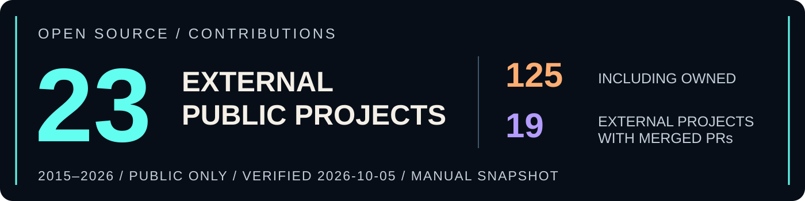

  

# Hey, I'm Fred.

**I build on Omarchy, connect machines, and give AI collaborators a memory.**

Native Linux tools. Useful automation. Interfaces with a little electricity.

**[Explore the plugins](https://omarchy.nixfred.com)** · **[Browse every public project](PROJECTS.md)** · **[GitHub](https://github.com/nixfred)**

## Start here

Six entry points into what I've been building lately. Each links to its own source, documentation and installation instructions.

| Project | The idea |
| :--- | :--- |
| **[Glide](https://github.com/nixfred/Glide)** | **One desk. Every machine.** Move your mouse and keyboard between Omarchy computers on the LAN. Powered by [Lan Mouse](https://github.com/feschber/lan-mouse). |
| **[Pulse](https://github.com/nixfred/pulse)** | **Find the bottleneck.** CPU, memory, storage, network and GPU monitoring in one Omarchy bar widget. |
| **[Omarchy Doctor](https://github.com/nixfred/omarchy-doctor)** | **See the evidence.** System diagnostics, live graphs, findings and an explicit handoff to your coding agent. |
| **[Imprint](https://github.com/nixfred/imprint)** | **Take your desktop with you.** Save a selectable desktop recipe, then preview and restore it on another working Omarchy installation. |
| **[Infomarchy](https://github.com/nixfred/infomarchy)** | **Put the context in view.** AI sessions, activity and machine information on your wallpaper. |
| **[Blip](https://github.com/nixfred/blip)** | **Messages meet Linux.** iMessage in the Omarchy bar, with your Mac acting as the gateway. |

<!-- BEGIN PUBLIC CONTRIBUTIONS -->
## Open source contributions

**23 public projects outside `nixfred/` · 125 including my own repositories · 19 external projects with merged PRs.**

Counted from GitHub-credited commits and merged pull requests since October 2015. Ownership, forks alone, open requests, issues and reviews do not qualify. Organization-owned repositories count as outside my personal namespace. **[Full inventory, evidence and refresh method →](CONTRIBUTIONS.md)**

See all 23 external contributor projects

| Public project | Verified evidence |
| :--- | :--- |
| [autonomous-ai/autonomous-os](https://github.com/autonomous-ai/autonomous-os) | [Credited commits](https://github.com/nixfred?tab=overview&from=2026-09-01&to=2026-09-30) · [Merged PR](https://github.com/autonomous-ai/autonomous-os/pull/529) (1) |
| [autonomous-ai/openharness](https://github.com/autonomous-ai/openharness) | [Credited commits](https://github.com/nixfred?tab=overview&from=2026-10-01&to=2026-10-31) |
| [calebhat/omarchy-weather](https://github.com/calebhat/omarchy-weather) | [Credited commits](https://github.com/nixfred?tab=overview&from=2026-09-01&to=2026-09-30) · [Merged PR](https://github.com/calebhat/omarchy-weather/pull/2) (1) |
| [csfh/atmos](https://github.com/csfh/atmos) | [Credited commits](https://github.com/nixfred?tab=overview&from=2026-09-01&to=2026-09-30) · [Merged PR](https://github.com/csfh/atmos/pull/13) (7) |
| [Different-Minds/.github](https://github.com/Different-Minds/.github) | [Credited commits](https://github.com/nixfred?tab=overview&from=2026-09-01&to=2026-09-30) |
| [DonnieFi/OmarPlugs](https://github.com/DonnieFi/OmarPlugs) | [Credited commits](https://github.com/nixfred?tab=overview&from=2026-09-01&to=2026-09-30) · [Merged PR](https://github.com/DonnieFi/OmarPlugs/pull/5) (5) |
| [duketopceo/dayflow-linux](https://github.com/duketopceo/dayflow-linux) | [Credited commits](https://github.com/nixfred?tab=overview&from=2026-10-01&to=2026-10-31) · [Merged PR](https://github.com/duketopceo/dayflow-linux/pull/51) (7) |
| [eduardodallecort/omarchy-weather-radar](https://github.com/eduardodallecort/omarchy-weather-radar) | [Credited commits](https://github.com/nixfred?tab=overview&from=2026-09-01&to=2026-09-30) · [Merged PR](https://github.com/eduardodallecort/omarchy-weather-radar/pull/10) (1) |
| [fross100/omaplug](https://github.com/fross100/omaplug) | [Credited commits](https://github.com/nixfred?tab=overview&from=2026-09-01&to=2026-09-30) · [Merged PR](https://github.com/fross100/omaplug/pull/18) (2) |
| [gardnmi/omacontra](https://github.com/gardnmi/omacontra) | [Credited commits](https://github.com/nixfred?tab=overview&from=2026-09-01&to=2026-09-30) · [Merged PR](https://github.com/gardnmi/omacontra/pull/1) (1) |
| [gladimdim/omarchy-config-sync-plugin](https://github.com/gladimdim/omarchy-config-sync-plugin) | [Credited commits](https://github.com/nixfred?tab=overview&from=2026-09-01&to=2026-09-30) · [Merged PR](https://github.com/gladimdim/omarchy-config-sync-plugin/pull/20) (3) |
| [GreyforgeLabs/slopbrake](https://github.com/GreyforgeLabs/slopbrake) | [Credited commits](https://github.com/nixfred?tab=overview&from=2026-09-01&to=2026-09-30) · [Merged PR](https://github.com/GreyforgeLabs/slopbrake/pull/1) (3) |
| [jankeesvw/omarchy-tesla](https://github.com/jankeesvw/omarchy-tesla) | [Credited commits](https://github.com/nixfred?tab=overview&from=2026-09-01&to=2026-09-30) · [Merged PR](https://github.com/jankeesvw/omarchy-tesla/pull/7) (1) |
| [jeremylanger/omaspotify](https://github.com/jeremylanger/omaspotify) · fork with merged PR | [Merged PR](https://github.com/jeremylanger/omaspotify/pull/10) (2) |
| [lgse/strata](https://github.com/lgse/strata) | [Credited commits](https://github.com/nixfred?tab=overview&from=2026-09-01&to=2026-09-30) |
| [mtolhuys/fathom](https://github.com/mtolhuys/fathom) | [Credited commits](https://github.com/nixfred?tab=overview&from=2026-09-01&to=2026-09-30) · [Merged PR](https://github.com/mtolhuys/fathom/pull/1) (4) |
| [mtolhuys/omarchy-theme-manager](https://github.com/mtolhuys/omarchy-theme-manager) | [Credited commits](https://github.com/nixfred?tab=overview&from=2026-09-01&to=2026-09-30) · [Merged PR](https://github.com/mtolhuys/omarchy-theme-manager/pull/1) (1) |
| [ryuhzk/omarchy-server-status](https://github.com/ryuhzk/omarchy-server-status) | [Credited commits](https://github.com/nixfred?tab=overview&from=2026-09-01&to=2026-09-30) · [Merged PR](https://github.com/ryuhzk/omarchy-server-status/pull/1) (1) |
| [sam-blakeman/OmarchyIPTV](https://github.com/sam-blakeman/OmarchyIPTV) | [Merged PR](https://github.com/sam-blakeman/OmarchyIPTV/pull/1) (1) |
| [sley-lang/sley](https://github.com/sley-lang/sley) | [Credited commits](https://github.com/nixfred?tab=overview&from=2026-09-01&to=2026-09-30) |
| [thefreshoffice/omarchy-speaker-calibrator](https://github.com/thefreshoffice/omarchy-speaker-calibrator) | [Credited commits](https://github.com/nixfred?tab=overview&from=2026-09-01&to=2026-09-30) · [Merged PR](https://github.com/thefreshoffice/omarchy-speaker-calibrator/pull/14) (2) |
| [thisisgm/flea](https://github.com/thisisgm/flea) | [Credited commits](https://github.com/nixfred?tab=overview&from=2026-09-01&to=2026-09-30) · [Merged PR](https://github.com/thisisgm/flea/pull/22) (4) |
| [wesleygrimes/omastorm](https://github.com/wesleygrimes/omastorm) | [Credited commits](https://github.com/nixfred?tab=overview&from=2026-09-01&to=2026-09-30) · [Merged PR](https://github.com/wesleygrimes/omastorm/pull/6) (1) |

Public-only snapshot verified 2026-10-05 (UTC). Refreshed manually; this panel does not update itself.
<!-- END PUBLIC CONTRIBUTIONS -->

## The desktop

I build plugins and tools around **[Omarchy](https://github.com/omacom/omarchy)**, **Hyprland** and **Quickshell**: things you can open from the bar, use at your desk, and adapt to your theme.

| Make it yours | Keep it connected | See what's happening |
| :--- | :--- | :--- |
| [Rift](https://github.com/nixfred/rift) — workspace app recall | [Clipsync](https://github.com/nixfred/clipsync) — cross-device clipboard | [Shipyard](https://github.com/nixfred/shipyard) — local commit activity |
| [Workspace Names](https://github.com/nixfred/workspace-names) — titles for numbered workspaces | [Lamplight](https://github.com/nixfred/lamplight) — theme-driven Govee lights | [Dockyard](https://github.com/nixfred/dockyard.omarchy) — Docker cockpit |
| [Plonk](https://github.com/nixfred/plonk) — close workspace gaps | [Beam](https://github.com/nixfred/beam) — Sunshine/Moonlight setup for iPad | [Sentinel](https://github.com/nixfred/sentinel.omarchy) — services and journal |
| [Pastey](https://github.com/nixfred/Pastey) — searchable clipboard history | [Sonomarchy](https://github.com/nixfred/sonomarchy) — Sonos audio outputs | [Pingboard](https://github.com/nixfred/pingboard.omarchy) — network-path diagnostics |

**Sound, light and time:** [Beatdeck](https://github.com/nixfred/beatdeck.omarchy) · [Lightshow](https://github.com/nixfred/lightshow) · [Footswitch](https://github.com/nixfred/footswitch) · [Hourglass](https://github.com/nixfred/hourglass) · [Tomato](https://github.com/nixfred/tomato.omarchy) · [Daylight](https://github.com/nixfred/daylight.omarchy).

**Built on others' work:** [Chronos](https://github.com/nixfred/omarchy-chronos) extends Omarchy's stock clock. [Swish](https://github.com/nixfred/swish) builds on [h3rmt/hyprshell](https://github.com/h3rmt/hyprshell). My GitHub forks, including Spotify, weather and file-manager projects, are [listed with their upstreams](PROJECTS.md#forks-and-upstream-credit).

## The collaborator

AI tools get more useful when the context survives the conversation. My public work here covers persistent memory, local models, desktop visibility and agent handoffs.

- **[LMF4.1](https://github.com/nixfred/lmf4.1)** — persistent memory for Claude Code, with searchable sessions, decisions and learnings.
- **[Claude on Mac](https://github.com/nixfred/claude-on-mac)** — Apple ecosystem tools for Claude Code, with consent controls for sending messages and mail.
- **[Local Intelligence](https://github.com/nixfred/omarchy-local-intelligence)** — Ollama monitoring and model controls from the Omarchy bar.
- **[PR Hunter](https://github.com/nixfred/pr.hunter)** — inspect GitHub work and hand a brief to an existing agent.
- **[Burnbar](https://github.com/nixfred/burnbar)** — Claude and Codex token-use visibility on the bar.

I also keep forks of **[firstmate](https://github.com/nixfred/firstmate)** ([kunchenguid](https://github.com/kunchenguid/firstmate)), **[slopbrake](https://github.com/nixfred/slopbrake)** ([GreyforgeLabs](https://github.com/GreyforgeLabs/slopbrake)), and **[nixfredOS](https://github.com/nixfred/nixfredOS)** ([Daniel Miessler's LifeOS](https://github.com/danielmiessler/LifeOS)). Their upstream authors deserve the credit. A fork's recent push date is not a claim that I authored every change.

## Beyond the bar

Some projects are practical tools. Others are interactive experiments.

| Tools and infrastructure | Interactive worlds |
| :--- | :--- |
| [Nixbash](https://github.com/nixfred/nixbash) — Linux server shell setup | [Galaxy](https://github.com/nixfred/galaxy.nixfred.com) — a Three.js project star map |
| [Remarchy](https://github.com/nixfred/remarchy) — declarative machine manifests | [The Great Filter](https://github.com/nixfred/filter) — a Fermi paradox simulator |
| [FeNix](https://github.com/nixfred/fenix) — ephemeral Linux containers | [Quantum](https://github.com/nixfred/quantum) — an interactive quantum computing essay |
| [Nixnet](https://github.com/nixfred/nixnet) — Git-backed host identity | [Physics](https://github.com/nixfred/physics) — an interactive physics field guide |
| [Ghostdrive](https://github.com/nixfred/ghostdrive) — portable offline AI | [One Day on Earth](https://github.com/nixfred/earth) — geological time in a day |

**[The complete public project catalog →](PROJECTS.md)** includes every public repository returned by GitHub in the latest audit, with actual last-push dates, fork origins, work-in-progress labels and a separate archive. Repository links remain the source of truth for current features and availability.

## How I like to build

Make the state visible. Keep the context. Verify the result. Credit the people whose work makes it possible.

**QML / Quickshell · Python · TypeScript · Bash · Rust · SQLite · Linux**

---

**[nixfred.com](https://nixfred.com)** · **[Omarchy plugins](https://omarchy.nixfred.com)** · **[@nixfred](https://github.com/nixfred)**

Project inventory verified from public GitHub data on 5 October 2026. All artwork above is original illustration, not a screenshot.
